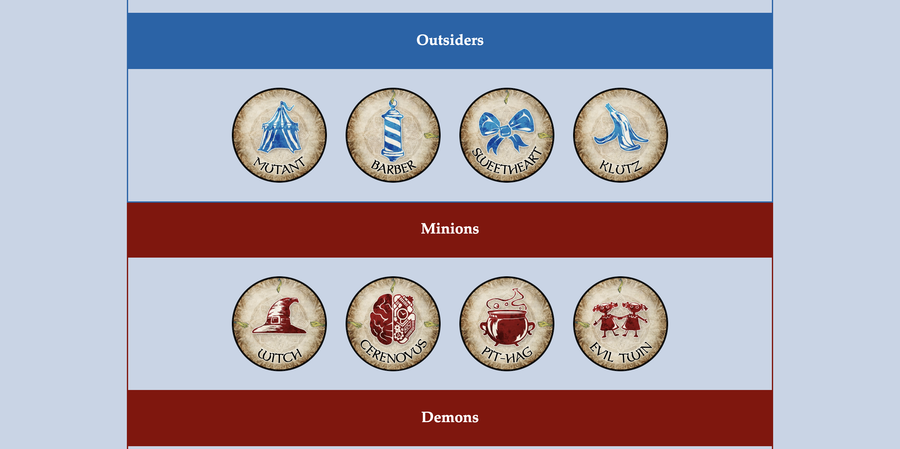
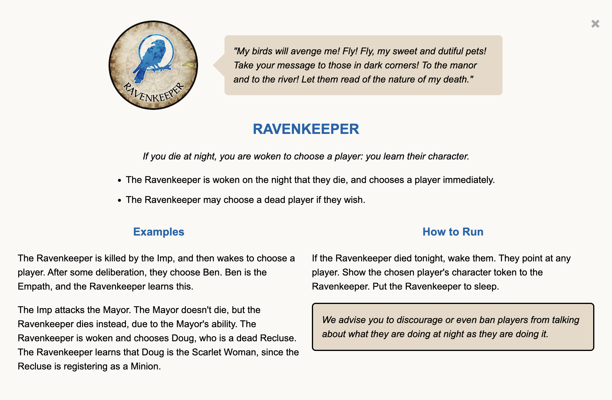
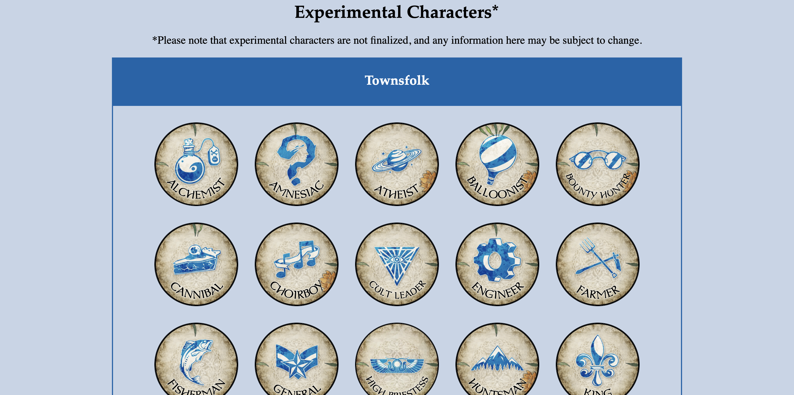

# One Page Blood on the Clocktower Almanac

This is an unofficial online tool that contains almanac entries for the characters of Blood on the Clocktower. The goal for this fan-made project was to allow storytellers and players to be able to quickly and efficiently look up how each character works and how to run them.

## Acknowledgements and Copyrights

* [Blood on the Clocktower](https://bloodontheclocktower.com/) is a trademark of Steven Medway and [The Pandemonium Institute](https://www.thepandemoniuminstitute.com/)
* Iconography by [Font Awesome](https://fontawesome.com/)
* All other images and icons are copyright to their respective owners

This project and its website are provided free of charge and not affiliated with The Pandemonium Institute in any way.

## Overview
This webpage allows users to quickly find the alamanac entry and token art for every character in Blood on the Clocktower. Users can navigate by script (a grouping of characters) by using the quick links at the top of the page, or they can simply scroll until they find their desired token/script.

The page is separated by the three base scripts (Trouble Brewing, Bad Moon Rising, and Sects & Violets), Experimental characters, Travellers, and Fabled. Within each script, there are further divisions for character type (Townsfolk, Outsider, Minion, Demon).

## Features

### Almanac Entry
When a token is clicked, a modal pops up with the character's:
- Name
- Quote
- Alignment (blue for good, red for evil)
- Ability
- Summary
- Examples
- How to Run

### Frequent Updates
This page is updated regularly when new characters are announced.

